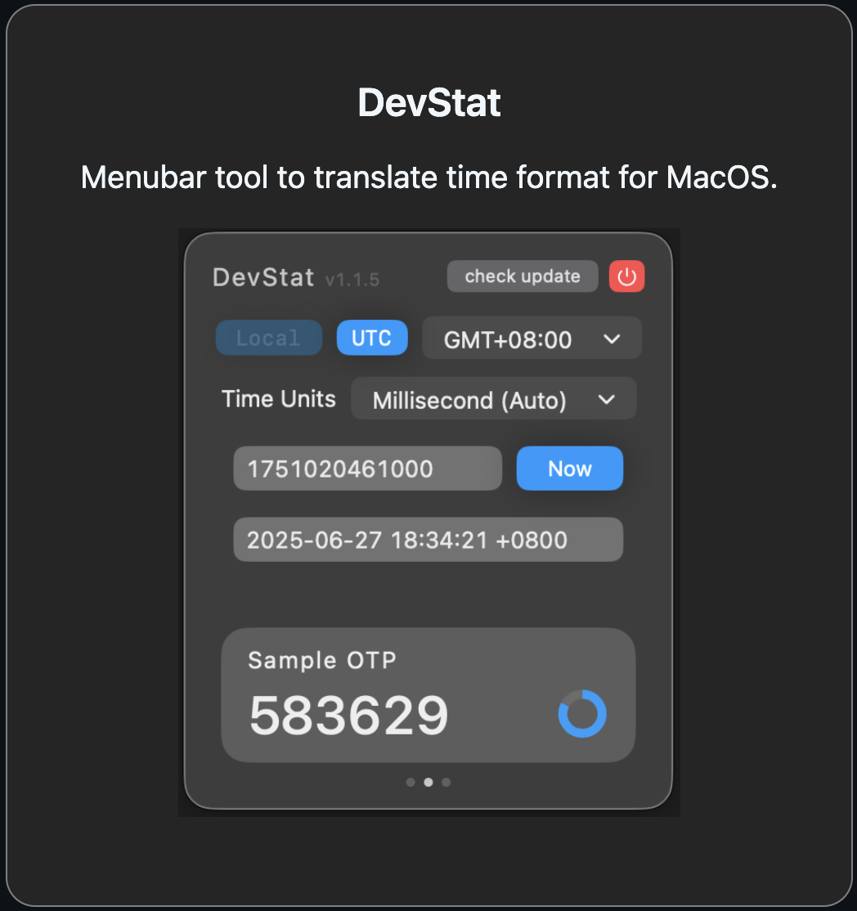

<h3 style="display:inline-block">Hello there, I'm Yanun</h3>
 

<!-- About me -->

👨🏻‍💻 &nbsp;Backend engineer with three years of experience in developing core cryptocurrency exchange systems
  
💻 &nbsp;Passionate about building application to solve life problem.

 
<h3>Product</h3>

 

<!-- Footer -->
<h3>How to reach me</h3>

&nbsp;
&nbsp;
&nbsp;
 

  

<!--  

&nbsp;
&nbsp;

 -->
<!--
**yanun0323/yanun0323** is a ✨ _special_ ✨ repository because its `README.md` (this file) appears on your GitHub profile.

Here are some ideas to get you started:

- 🔭 I’m currently working on ...
- 🌱 I’m currently learning ...
- 👯 I’m looking to collaborate on ...
- 🤔 I’m looking for help with ...
- 💬 Ask me about ...
- 📫 How to reach me: ...
- 😄 Pronouns: ...
- ⚡ Fun fact: ...
-->
